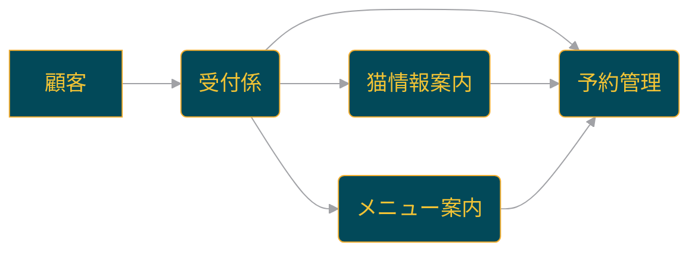

<p align="center">
  
  <h1 align="center">🐈 swarm-cat-cafe 🐈</h1>
</p>
<p align="center">
  <a href="https://github.com/Sunwood-ai-labs/swarm-cat-cafe">
    
  </a>
  <a href="https://github.com/Sunwood-ai-labs/swarm-cat-cafe/blob/main/LICENSE">
    
  </a>
  <a href="https://github.com/Sunwood-ai-labs/swarm-cat-cafe/stargazers">
    
  </a>
  <a href="https://github.com/Sunwood-ai-labs/swarm-cat-cafe/releases">
    
  </a>
  <a href="https://github.com/Sunwood-ai-labs/swarm-cat-cafe/issues">
    
  </a>
  <a href="https://github.com/Sunwood-ai-labs/swarm-cat-cafe/pulls">
    
  </a>
  <a href="https://github.com/Sunwood-ai-labs/swarm-cat-cafe/network/members">
    
  </a>
  <a href="https://github.com/Sunwood-ai-labs/swarm-cat-cafe/watchers">
    
  </a>
  
  
</p>
<h2 align="center">
  ～ 猫カフェのためのAI応答システム ～

<a href="https://github.com/Sunwood-ai-labs/swarm-cat-cafe/blob/main/README.md"></a>
<a href="https://github.com/Sunwood-ai-labs/swarm-cat-cafe/blob/main/docs/README.en.md"></a>
</h2>
<p align="center">
  
  
  
</p>


## 🚀 プロジェクト概要

このプロジェクトは、Swarmフレームワークを使用して猫カフェの自動応答システムを実装したものです。複数のAIエージェントが協力して、顧客からの様々な問い合わせに対応します。  v0.1.0では、READMEの画像パス修正、リポジトリ情報とロゴの変更、そして英語READMEの更新を行いました。 猫カフェの画像を追加し、Swarmフレームワークを用いた猫カフェAIシステムの基盤となるコードを実装しました。


## ✨ 主な機能

- 受付係エージェント: 顧客の質問を理解し、適切なエージェントに転送します。
- メニュー案内エージェント: カフェのメニューに関する質問に答えます。
- 予約管理エージェント: 予約の作成、確認、キャンセルを管理します。
- 猫の情報案内エージェント: カフェにいる猫たちの情報を提供します。
- 🎉  v0.1.0では、各エージェント(受付係、メニュー案内、予約管理、猫の情報案内)とメイン実行ファイルを追加しました。


## 🔧 使用方法

### セットアップ

1. プロジェクトをクローンまたはダウンロードします。

2. 仮想環境を作成し、アクティベートします：

```bash
python -m venv venv
source venv/bin/activate  # Linuxの場合
venv\Scripts\activate  # Windowsの場合
```

3. 必要なパッケージをインストールします：

```bash
pip install -r requirements.txt
```

4. `main.py`があるディレクトリに移動します。


### 実行

以下のコマンドでシステムを起動します：

```bash
python main.py
```

起動後、コンソール上で猫カフェのAI応答システムとやり取りができます。質問を入力し、エージェントからの応答を受け取ることができます。


## 📦 インストール手順

1. このリポジトリをクローンします。
2. 必要な依存関係をインストールします：
   ```bash
   pip install -r requirements.txt
   ```


## 🌿 環境構築

このプロジェクトの環境を構築するには、以下の手順に従ってください：

1. 仮想環境を作成します：
   ```bash
   python3 -m venv .venv
   ```
   これにより、`.venv`ディレクトリに仮想環境が作成されます。

2. 仮想環境をアクティベートします：
   ```bash
   source .venv/bin/activate  # Linux/macOS
   .venv\Scripts\activate  # Windows
   ```

3. 依存関係をインストールします：

   ```bash
   pip install -r requirements.txt
   ```

これらの手順により、このプロジェクトの開発環境が整います。


## 📚 主要コンポーネント

### 🤖 [Swarm](https://github.com/openai/swarm)
- OpenAIが開発した、複数のAIエージェントが協力してタスクを実行するためのフレームワーク

### 🤖 [swarm-sample-box](https://github.com/Sunwood-ai-labs/swarm-sample-box)
- Swarmの日本語チュートリアル


## 🐈 処理フロー





## 🤝 コントリビューション

このプロジェクトはオープンソースプロジェクトとしてコミュニティからの貢献を歓迎しています。バグ報告、機能リクエスト、プルリクエストを通じて、このプロジェクトの改善にご協力ください。

## 📄 ライセンス

このプロジェクトはMITライセンスの下で公開されています。

## 🙏 謝辞

iris-s-coon、Maki 

## 🆕 最新情報 (v0.1.0)

- 🎉 猫カフェ画像を追加しました。
- 🎉 Swarmフレームワークを用いた猫カフェAIシステムのメイン実行ファイルを追加しました。
- 🎉 各エージェント(受付係、メニュー案内、予約管理、猫の情報案内)を追加しました。
- 🎉 Swarmエージェントで使用される関数を定義しました。
- 🎉 予約情報操作関数ファイル、メニュー情報取得関数ファイル、猫の情報取得関数ファイル、関数ファイルの初期化ファイル、Swarmエージェントの初期化ファイルを追加しました。
- 🚀 README.mdの画像パスを修正しました。
- 🚀 README.mdを更新しました。
- ⚠️ リポジトリ名が`HarmonAI_III`から`swarm-cat-cafe`に変更されました。
- ⚠️ リポジトリ名変更に伴い、関連設定が更新されました。


---
