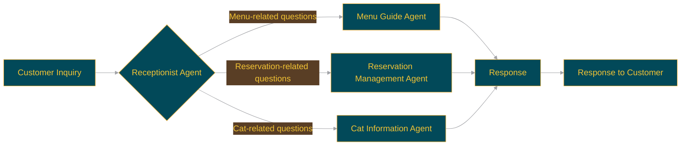

<p align="center">
  
  <h1 align="center">🐈 swarm-cat-cafe 🐈</h1>
</p>
<p align="center">
  <a href="https://github.com/Sunwood-ai-labs/swarm-cat-cafe">
    
  </a>
  <a href="https://github.com/Sunwood-ai-labs/swarm-cat-cafe/blob/main/LICENSE">
    
  </a>
  <a href="https://github.com/Sunwood-ai-labs/swarm-cat-cafe/stargazers">
    
  </a>
  <a href="https://github.com/Sunwood-ai-labs/swarm-cat-cafe/releases">
    
  </a>
  <a href="https://github.com/Sunwood-ai-labs/swarm-cat-cafe/issues">
    
  </a>
  <a href="https://github.com/Sunwood-ai-labs/swarm-cat-cafe/pulls">
    
  </a>
  <a href="https://github.com/Sunwood-ai-labs/swarm-cat-cafe/network/members">
    
  </a>
  <a href="https://github.com/Sunwood-ai-labs/swarm-cat-cafe/watchers">
    
  </a>
  
  
</p>
<h2 align="center">
  ～ AI Response System for Cat Cafes ～

<a href="https://github.com/Sunwood-ai-labs/swarm-cat-cafe/blob/main/README.md"></a>
<a href="https://github.com/Sunwood-ai-labs/swarm-cat-cafe/blob/main/docs/README.en.md"></a>
</h2>
<p align="center">
  
  
  
</p>


## 🚀 Project Overview

This project implements an automated response system for cat cafes using the Swarm framework. Multiple AI agents collaborate to handle various customer inquiries.


## ✨ Main Features

- **Receptionist Agent:** Understands customer questions and transfers them to the appropriate agent.
- **Menu Guide Agent:** Answers questions about the cafe's menu.
- **Reservation Management Agent:** Manages the creation, confirmation, and cancellation of reservations.
- **Cat Information Agent:** Provides information about the cats in the cafe.


## 🔧 How to Use


### Setup

1. Clone or download the project.

2. Create and activate a virtual environment:

```bash
python -m venv venv
source venv/bin/activate  # Linux
venv\Scripts\activate  # Windows
```

3. Install the necessary packages:

```bash
pip install -r requirements.txt
```

4. Navigate to the directory containing `main.py`.


### Usage

Start the system with the following command:

```bash
python main.py
```

After starting, you can interact with the cat cafe's AI response system on the console.  Enter your questions and receive responses from the agents.


## 📦 Installation Instructions

1. Clone this repository.
2. Install the required dependencies:
   ```bash
   pip install -r requirements.txt
   ```


## 🌿 Environment Setup

Follow these steps to set up the environment for this project:

1. Create a virtual environment:
   ```bash
   python3 -m venv .venv
   ```
   This creates a virtual environment in the `.venv` directory.

2. Activate the virtual environment:
   ```bash
   source .venv/bin/activate  # Linux/macOS
   .venv\Scripts\activate  # Windows
   ```

3. Install dependencies:

   ```bash
   pip install -r requirements.txt
   ```

These steps will prepare the development environment for this project.


## 📚 Major Components

### 🤖 [Swarm](https://github.com/openai/swarm)
- A framework developed by OpenAI that allows multiple AI agents to collaborate to perform tasks.


## 🐈 Processing Flow





## 🤝 Contributions

This project is open source and welcomes contributions from the community. Please help improve this project through bug reports, feature requests, and pull requests.

## 📄 License

This project is licensed under the MIT License.

## 🙏 Acknowledgements


---