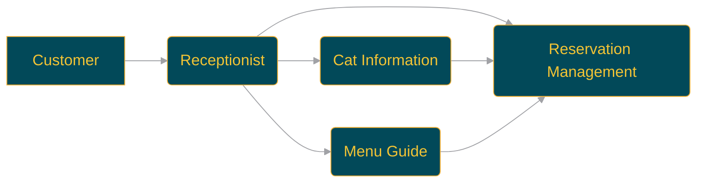

<p align="center">
  
  <h1 align="center">🐈 swarm-cat-cafe 🐈</h1>
</p>
<p align="center">
  <a href="https://github.com/Sunwood-ai-labs/swarm-cat-cafe">
    
  </a>
  <a href="https://github.com/Sunwood-ai-labs/swarm-cat-cafe/blob/main/LICENSE">
    
  </a>
  <a href="https://github.com/Sunwood-ai-labs/swarm-cat-cafe/stargazers">
    
  </a>
  <a href="https://github.com/Sunwood-ai-labs/swarm-cat-cafe/releases">
    
  </a>
  <a href="https://github.com/Sunwood-ai-labs/swarm-cat-cafe/issues">
    
  </a>
  <a href="https://github.com/Sunwood-ai-labs/swarm-cat-cafe/pulls">
    
  </a>
  <a href="https://github.com/Sunwood-ai-labs/swarm-cat-cafe/network/members">
    
  </a>
  <a href="https://github.com/Sunwood-ai-labs/swarm-cat-cafe/watchers">
    
  </a>
  
  
</p>
<h2 align="center">
  ～ AI Response System for Cat Cafes ～

<a href="https://github.com/Sunwood-ai-labs/swarm-cat-cafe/blob/main/README.md"></a>
<a href="https://github.com/Sunwood-ai-labs/swarm-cat-cafe/blob/main/docs/README.en.md"></a>
</h2>
<p align="center">
  
  
  
</p>


## 🚀 Project Overview

This project implements an automated response system for a cat cafe using the Swarm framework. Multiple AI agents collaborate to handle various customer inquiries.  Version 0.1.0 includes README image path corrections, repository information and logo changes, and updates to the English README.  A cat cafe image has been added, and the core code for a cat cafe AI system using the Swarm framework has been implemented.


## ✨ Main Features

- Receptionist Agent: Understands customer questions and transfers them to the appropriate agent.
- Menu Guide Agent: Answers questions about the cafe's menu.
- Reservation Management Agent: Manages the creation, confirmation, and cancellation of reservations.
- Cat Information Agent: Provides information about the cats at the cafe.
- 🎉 Version 0.1.0 includes each agent (receptionist, menu guide, reservation management, cat information) and the main execution file.


## 🔧 How to Use

### Setup

1. Clone or download the project.

2. Create and activate a virtual environment:

```bash
python -m venv venv
source venv/bin/activate  # Linux
venv\Scripts\activate  # Windows
```

3. Install the necessary packages:

```bash
pip install -r requirements.txt
```

4. Navigate to the directory containing `main.py`.


### Execution

Start the system with the following command:

```bash
python main.py
```

After startup, you can interact with the cat cafe's AI response system on the console. Enter your questions and receive responses from the agents.


## 📦 Installation Instructions

1. Clone this repository.
2. Install the necessary dependencies:
   ```bash
   pip install -r requirements.txt
   ```


## 🌿 Environment Setup

To set up the environment for this project, follow these steps:

1. Create a virtual environment:
   ```bash
   python3 -m venv .venv
   ```
   This creates a virtual environment in the `.venv` directory.

2. Activate the virtual environment:
   ```bash
   source .venv/bin/activate  # Linux/macOS
   .venv\Scripts\activate  # Windows
   ```

3. Install dependencies:

   ```bash
   pip install -r requirements.txt
   ```

These steps will prepare the development environment for this project.


## 📚 Major Components

### 🤖 [Swarm](https://github.com/openai/swarm)
- A framework developed by OpenAI for multiple AI agents to collaborate on tasks.

### 🤖 [swarm-sample-box](https://github.com/Sunwood-ai-labs/swarm-sample-box)
- A Japanese tutorial for Swarm.


## 🐈 Processing Flow





## 🤝 Contributions

This project is an open-source project and welcomes contributions from the community. Please help improve this project through bug reports, feature requests, and pull requests.

## 📄 License

This project is licensed under the MIT License.

## 🙏 Acknowledgements

iris-s-coon, Maki

## 🆕 Latest Information (v0.1.0)

- 🎉 Added cat cafe image.
- 🎉 Added the main execution file for the cat cafe AI system using the Swarm framework.
- 🎉 Added each agent (receptionist, menu guide, reservation management, cat information).
- 🎉 Defined functions used by Swarm agents.
- 🎉 Added reservation information manipulation function file, menu information acquisition function file, cat information acquisition function file, function file initialization file, and Swarm agent initialization file.
- 🚀 Corrected the image path in README.md.
- 🚀 Updated README.md.
- ⚠️ Repository name changed from `HarmonAI_III` to `swarm-cat-cafe`.
- ⚠️ Related settings have been updated due to the repository name change.


---